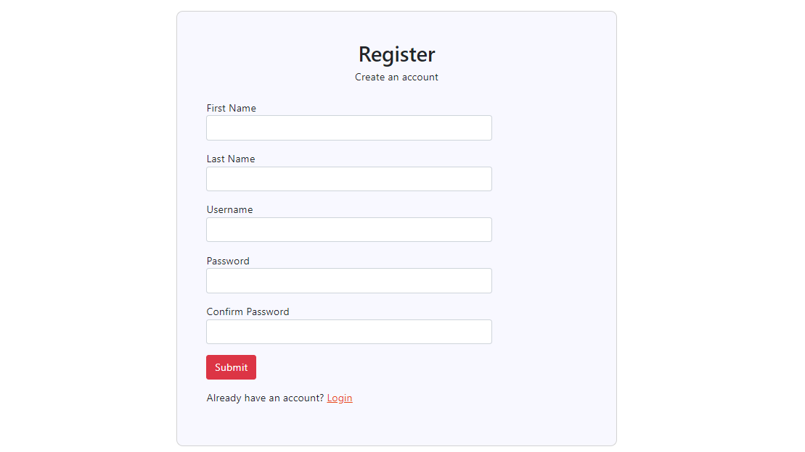
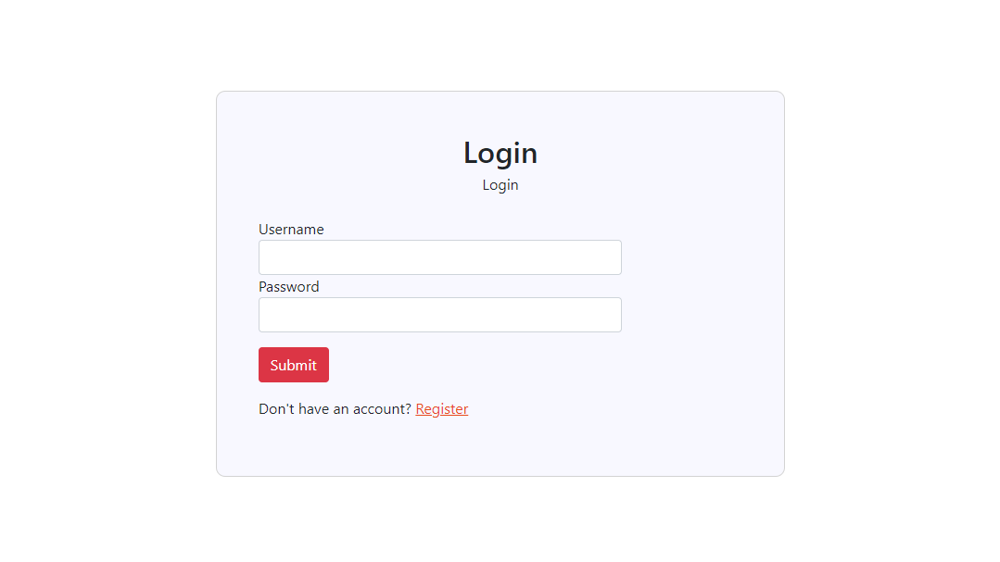
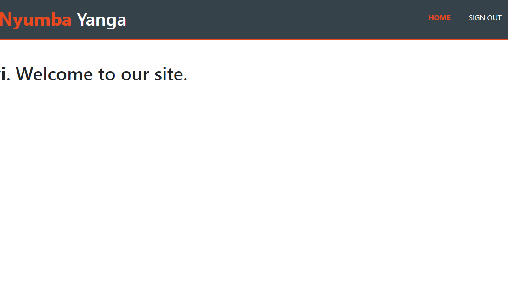

# Registration Login and Logout System in PHP
A login and signup form with validation using HTML, PHP, and MySQL. This form allows users to register and login. All information is stored in a MySQL database. After successful login the user is redirected to welcome page.
# Features
- Nice and easy user interface.
- Stores all the user detials in the database.
- Passwords in the database are stored in an encrypted format.
# Installation process
- Download the source code in zip format or you can just clone the repository.
- Extract the file.
- Copy it to C:\xampp\htdocs\ ( That is if you are using xampp as your server like i am).
- Go to your localhost http://127.0.0.1/phpmyadmin/ and create a database.
- Export the database table that is in users-table folder.
- And finally configure your database connection in the config.php file.
# Landing Page
This is the landing page of the system and as you can see, it is nice and straightforward.

# Registration form
Enter your details so that you can be registered in the system.

# Login form
Login using your username and password you used when registering .

# Welcome page
Once logged in, you will be redirected to the welcome page as shown below.

